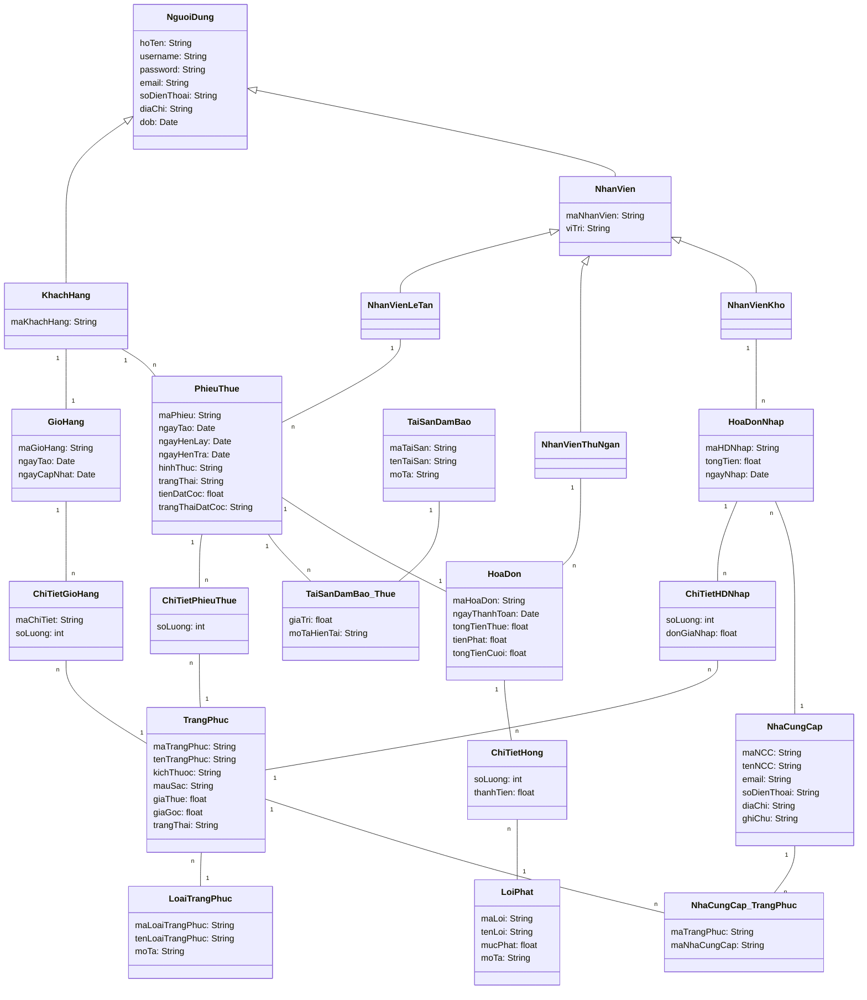

# UML Class Diagram (Mermaid) – Hệ thống Quản Lý Thuê Trang Phục

## 📌 Mô tả

Tài liệu này biểu diễn toàn bộ các thực thể và mối quan hệ trong hệ thống dưới dạng **Mermaid Class Diagram**, phục vụ cho việc thiết kế và triển khai (đặc biệt phù hợp với kiến trúc microservices).

---

## 📊 Mermaid UML Diagram

---

## ✅ Ghi chú thiết kế

* Các bảng `ChiTiet*` đóng vai trò **bảng trung gian (junction table)** cho quan hệ nhiều-nhiều.
* `PhieuThue` là **core entity** của hệ thống.
* `HoaDon` tách riêng để phục vụ **payment domain (microservice)**.
* `TaiSanDamBao` được thiết kế linh hoạt thông qua bảng liên kết `TaiSanDamBao_Thue`.
* Hệ thống phù hợp để tách thành các service:

  * Customer Service
  * Order/Rental Service
  * Inventory Service
  * Payment Service
  * Supplier Service

---

| Thực thể A       | Thực thể B           | Quan hệ | Mô tả                                    |
| ---------------- | -------------------- | ------- | ---------------------------------------- |
| NguoiDung        | KhachHang            | 1 - 1   | Một người dùng có thể là khách hàng      |
| NguoiDung        | NhanVien             | 1 - 1   | Một người dùng có thể là nhân viên       |
| NhanVien         | NhanVienLeTan        | 1 - 1   | Kế thừa (nhân viên lễ tân)               |
| NhanVien         | NhanVienThuNgan      | 1 - 1   | Kế thừa (thu ngân)                       |
| NhanVien         | NhanVienKho          | 1 - 1   | Kế thừa (kho)                            |
| KhachHang        | GioHang              | 1 - 1   | Mỗi khách hàng có một giỏ hàng           |
| GioHang          | ChiTietGioHang       | 1 - N   | Một giỏ hàng chứa nhiều sản phẩm         |
| ChiTietGioHang   | TrangPhuc            | N - 1   | Mỗi dòng giỏ hàng tương ứng 1 trang phục |
| KhachHang        | PhieuThue            | 1 - N   | Khách hàng có thể tạo nhiều phiếu thuê   |
| NhanVienLeTan    | PhieuThue            | 1 - N   | Lễ tân tạo phiếu thuê                    |
| PhieuThue        | ChiTietPhieuThue     | 1 - N   | Phiếu thuê gồm nhiều sản phẩm            |
| ChiTietPhieuThue | TrangPhuc            | N - 1   | Mỗi dòng là 1 trang phục                 |
| TrangPhuc        | LoaiTrangPhuc        | N - 1   | Trang phục thuộc một loại                |
| PhieuThue        | TaiSanDamBao_Thue    | 1 - N   | Có thể có nhiều tài sản đảm bảo          |
| TaiSanDamBao     | TaiSanDamBao_Thue    | 1 - N   | Một tài sản dùng cho nhiều lần thuê      |
| PhieuThue        | HoaDon               | 1 - 1   | Mỗi phiếu thuê có 1 hóa đơn              |
| NhanVienThuNgan  | HoaDon               | 1 - N   | Thu ngân xử lý hóa đơn                   |
| HoaDon           | ChiTietHong          | 1 - N   | Ghi nhận các lỗi/hư hỏng                 |
| ChiTietHong      | LoiPhat              | N - 1   | Mỗi lỗi thuộc một loại lỗi               |
| TrangPhuc        | NhaCungCap_TrangPhuc | 1 - N   | Trang phục có nhiều nhà cung cấp         |
| NhaCungCap       | NhaCungCap_TrangPhuc | 1 - N   | Nhà cung cấp cung cấp nhiều trang phục   |
| HoaDonNhap       | ChiTietHDNhap        | 1 - N   | Hóa đơn nhập gồm nhiều sản phẩm          |
| ChiTietHDNhap    | TrangPhuc            | N - 1   | Mỗi dòng nhập là 1 trang phục            |
| HoaDonNhap       | NhaCungCap           | N - 1   | Nhập hàng từ 1 nhà cung cấp              |
| NhanVienKho      | HoaDonNhap           | 1 - N   | Nhân viên kho thực hiện nhập hàng        |
