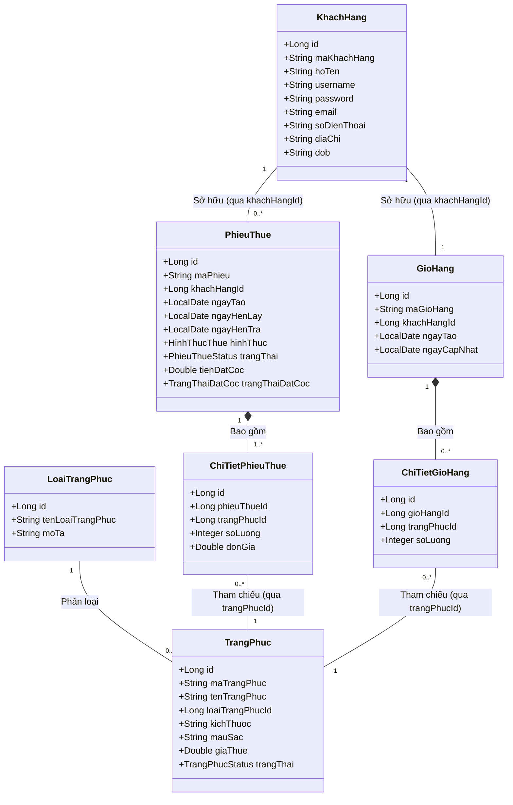

# Costume Rental – Microservices Architecture

Dự án Hệ thống cho thuê trang phục online được thiết kế theo kiến trúc Microservices sử dụng **Java & Spring Boot**. 

Dự án hiện tại đã được tinh gọn và tập trung hoàn toàn vào 2 module chính:
1. **Nhóm Quản lý:** Quản lý khách hàng
2. **Nhóm Chức năng:** Khách hàng đặt trang phục online

---

## 🏛 Tổng quan kiến trúc

Hệ thống bao gồm các services hoạt động độc lập và giao tiếp với nhau:

```text
discovery-server  :8761   ← Service Registry (Quản lý service)
api-gateway       :8080   ← Định tuyến (Routing) & CORS
customer-service  :8081   ← Service Quản lý khách hàng (CRUD)
costume-service   :8082   ← Service Truy xuất trang phục (Read-only từ KH)
order-service     :8083   ← Service Đặt hàng, Giỏ hàng & Đặt cọc
```

---

## 📊 Biểu đồ lớp thực thể (Class Diagram)

Dưới đây là sơ đồ UML mô tả cấu trúc các Entity và mối quan hệ giữa chúng trong toàn bộ hệ thống Microservices (đã bao gồm các Entity mới cho chức năng Giỏ hàng và chuẩn hóa 3NF):



---

## 🗄 Cơ sở dữ liệu (MySQL)

Mỗi Microservice quản lý một database độc lập nhằm đảm bảo tính phân tán (Decentralized Data Management). Toàn bộ được cấu hình tự động khởi tạo và insert dữ liệu mẫu qua Docker (file `init.sql`).
* `customer_db`
* `costume_db`
* `order_db` (Bao gồm các bảng: `phieu_thue`, `chi_tiet_phieu_thue`, `gio_hang`, `chi_tiet_gio_hang`)

Mặc định kết nối: `root / 123456 @ localhost:3306`
*(Có thể thay đổi trong `application.yml` của từng service nếu cần)*

---

## 🚀 Danh sách API Endpoints hiện hành

### 1. customer-service (:8081) - *Quản lý Khách hàng*
| Method | Path | Mô tả |
|---|---|---|
| `GET` | `/api/khach-hang` | Lấy danh sách toàn bộ khách hàng |
| `GET` | `/api/khach-hang/{id}` | Lấy chi tiết thông tin 1 khách hàng |
| `POST` | `/api/khach-hang` | Tạo mới khách hàng |
| `PUT` | `/api/khach-hang/{id}` | Cập nhật thông tin khách hàng |
| `DELETE` | `/api/khach-hang/{id}` | Xóa khách hàng |

### 2. costume-service (:8082) - *Tra cứu Trang phục*
| Method | Path | Mô tả |
|---|---|---|
| `GET` | `/api/trang-phuc` | Xem danh sách tất cả trang phục |
| `GET` | `/api/trang-phuc/available` | Lấy danh sách trang phục đang còn trống (Sẵn sàng cho thuê) |
| `GET` | `/api/trang-phuc/loai/{loaiId}` | Lọc trang phục còn trống theo danh mục (ID Loại) |
| `GET` | `/api/trang-phuc/{id}` | Lấy thông tin chi tiết trang phục |
| `PATCH` | `/api/trang-phuc/{id}/trang-thai` | *(Internal)* Đổi trạng thái đồ sang RENTED khi có đơn đặt hàng |

### 3. order-service (:8083) - *Khách hàng đặt online & Giỏ hàng*
| Method | Path | Mô tả |
|---|---|---|
| `POST` | `/api/phieu-thue/gio-hang/{khachHangId}?trangPhucId={id}` | Thêm trang phục vào giỏ hàng |
| `GET` | `/api/phieu-thue/gio-hang/{khachHangId}` | Xem danh sách các trang phục đang có trong giỏ hàng |
| `DELETE` | `/api/phieu-thue/gio-hang/{khachHangId}?trangPhucId={id}` | Xóa trang phục khỏi giỏ hàng |
| `POST` | `/api/phieu-thue/khach-hang/{khachHangId}`| Khách hàng tạo phiếu thuê (tự động lấy toàn bộ đồ từ giỏ hàng để chốt) |
| `GET` | `/api/phieu-thue/khach-hang/{khachHangId}` | Xem lịch sử các phiếu thuê của 1 khách hàng |
| `GET` | `/api/phieu-thue/{maPhieu}` | Xem chi tiết 1 phiếu thuê |
| `PATCH` | `/api/phieu-thue/{maPhieu}/dat-coc` | Khách hàng thanh toán xác nhận đặt cọc (30%) |

---

## 🐳 Hướng dẫn chạy dự án với Docker Compose

Đảm bảo bạn đã cài đặt **Docker** và **Docker Compose**.

**Bước 1:** Dọn dẹp volume cũ của database (Rất quan trọng nếu có thay đổi cấu trúc bảng):
```bash
docker-compose down -v
```

**Bước 2:** Build toàn bộ các file `.jar` của Spring Boot (bằng Maven):
*(Yêu cầu đã cài đặt JDK 17+ và Maven)*
```bash
mvn clean install -DskipTests
```

**Bước 3:** Chạy lệnh Docker Compose tại thư mục gốc của project để build và khởi chạy toàn bộ hệ thống:
```bash
docker-compose up --build -d
```

**Bước 4:** Kiểm tra trạng thái hệ thống:
* **Eureka Dashboard:** Truy cập `http://localhost:8761` để kiểm tra các service đã đăng ký thành công chưa.
* **Gọi API test qua Gateway:** Sử dụng Postman gọi vào cổng `8080` (Ví dụ: `GET http://localhost:8080/api/khach-hang`).